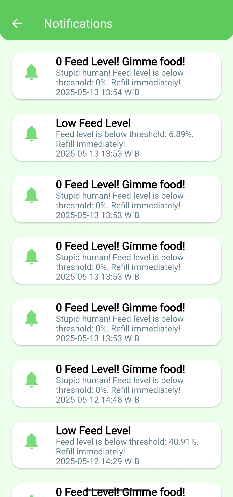

# SmartFeed

SmartFeed is a smart bird pet feeder app built with Flutter and Firebase. It allows you to monitor and control your bird pet's feeding device remotely, view feeding history, receive notifications, and manage your account securely.

---

## ✨ Features

- **Dashboard:**  
  View device status, feed level, food threshold, last fed time, and feeding schedule.  

- **Manual Feeding:**  
  Trigger feeding instantly from the dashboard.

- **Feeding Schedule:**  
  Set and edit scheduled feeding times for your device.

- **Feeding History:**  
  Browse all past feeding events, including manual and scheduled feeds.  

- **Notifications:**  
  Receive and view notifications for low feed level, refill reminders, and other device alerts.  

- **Account Management:**  
  - Change your name and password securely.  
  - View your account details and logout.

- **Settings:**  
  Access app version, about info, and account actions.  

- **Authentication:**  
  Secure login and password reset.  

---

## 📱 Screenshots

| Dashboard | Threshold Warning | 0 Feed Level | 
|-----------|-------------------|--------------|
|  |  |  | 

| History | Settings | Change Name | Change Password |
|---------|----------|-------------|-----------------|
|  |  |  |  | 

| Notifications | About | Login | Reset Password |
|---------------|-------|-------|----------------|
|  |  |  |  |

---

## 🗄️ Database Structure

See [`db.txt`](db.txt) for the full Firestore schema.

---

## 🚀 Getting Started

Follow these steps to set up and run the project:

### 1. Clone the Repository

```bash
git clone https://github.com/DSC-UNSRI/Secure-MVC-Flutter-Firebase-Example.git
cd Secure-MVC-Flutter-Firebase-Example
```

### 2. Install Dependencies

```bash
flutter pub get
```

### 3. Configure Gradle Properties

- Open `android/gradle.properties`
- Delete the line `org.gradle.java.home=value` or change with your defined Java Home Path.

### 4. Configure Firebase

- Download and install [Firebase CLI](https://firebase.google.com/docs/cli) (you may use npm or use standalone package).
- Make sure `firebase` command is recognized (run in CMD). If not, make sure to have the firebase tools defined in environment variable path.
- Navigate to [Firebase Console](https://console.firebase.google.com/u/0/) and click `Create a Firebase project`. Then, just follow the instructions.
- After created, navigate to `Overview` and click `Add App > Android`. Then, just follow the instructions (make sure the Android package name is the same as your `android/app/build.gradle` applicationId).
- After Android app created in Firebase Console, navigate to `Overview` and click `Build > Authentication` and `Build > Firestore Database` (just follow the instructions on creation, choose the closest server with your country (e.g. Jakarta), use Test Mode Rules at the moment).
- Back to your IDE or Code Editor, open up terminal and run `firebase login` (just follow the instructions to login your Google Account [use the same as your Firebase Account]).
- After successfully logged in, change `lib/firebase_options.dart` to `lib/firebase_options.dart.backup` and run `dart pub global activate flutterfire_cli` then `flutterfire configure --project=YOUR-FIREBASE-PROJECT-ID` (configure only for Android and iOS, use Space to disable other platforms). It will generate and replace `lib/firebase_options.dart`.

### 5. Generate Encrypted Environment Keys

- Add all `FirebaseOptions android` values inside `lib/firebase_options.dart` to `.env`. Look at the this original repository `lib/firebase_options.dart` (before you replace it using flutterfire configure) to modify and proceed (don't push API keys to source control, bud).
- Run `dart run build_runner build --define flutter_secure_dotenv_generator:flutter_secure_dotenv=OUTPUT_FILE=encryption_key.json`.
- Change `.vscode/launch.json` `ENCRYPTION_KEY` and `IV_KEY` based on generated `encryption_key.json` (root-level folder).
- Use `Run and Debug` (CTRL + SHIFT + D) feature and debug the app using your favorite Android emulator or via USB debugging.

---

## 🛠️ Tech Stack

- **Flutter** (Dart)
- **Firebase** (Auth, Firestore, Messaging)
- **MVC** (Model-View-Controller architecture for separation of concerns)

---

## 📂 Project Structure

- `lib/view/` — All UI screens (dashboard, history, notifications, settings, auth, etc.)
- `lib/controller/` — Business logic and Firestore interaction
- `lib/model/` — Data models
- `lib/util/` — Utilities (date formatting, validators, etc.)
- `assets/` — App images and SVG illustrations
- `screenshots/` — App screenshots for documentation

---
